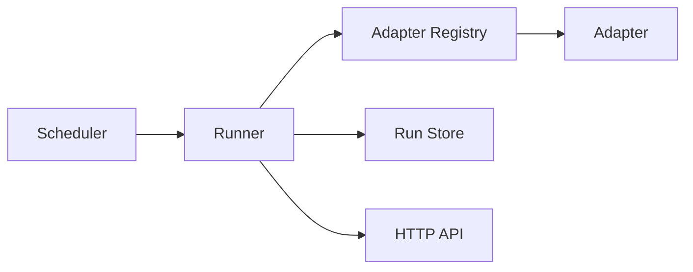

# Poised

Poised is a backend-only framework for recurring jobs and monitoring workflows.
The first version keeps the core small: a scheduler triggers jobs, a runner calls
registered adapters, and run results are stored through a storage interface.

## Current Stack

- Language: Go
- Runtime: single backend process
- Scheduling: in-process interval scheduler
- API: Go standard `net/http`
- Storage: in-memory implementation behind an interface
- Adapter model: compile-time registry for the first version

The code intentionally uses only the Go standard library for the initial frame,
so the project can build and run without downloading dependencies. The next
natural upgrades are Postgres storage, a cron scheduler, and Temporal workflows.

## Run

```bash
go run ./cmd/poised -config configs/poised.example.json
```

The service listens on `127.0.0.1:8080` by default.
Set `POISED_HTTP_ADDR=0.0.0.0:8080` when running in a container.

Useful endpoints:

```bash
curl http://127.0.0.1:8080/healthz
curl http://127.0.0.1:8080/v1/adapters
curl http://127.0.0.1:8080/v1/jobs
curl http://127.0.0.1:8080/v1/runs
curl -X POST http://127.0.0.1:8080/v1/jobs/example-echo/runs
```

The CLI can talk to the API:

```bash
go run ./cmd/poisedctl adapters
go run ./cmd/poisedctl jobs
go run ./cmd/poisedctl run example-echo
go run ./cmd/poisedctl runs
```

Or use the convenience targets:

```bash
make test
make run
make build
docker compose up --build
```

## Add An Adapter

Create a package under `internal/adapters/<name>` and implement:

```go
type Adapter interface {
    Name() string
    Kind() string
    Run(ctx context.Context, input core.RunInput) (core.RunResult, error)
}
```

Then register it in `cmd/poised/main.go`:

```go
registry.Register(myadapter.New())
```

Adapter payloads are configured per job in `configs/poised.example.json`.

## Target Architecture



Near-term upgrades:

- Replace in-memory store with Postgres repositories.
- Add `robfig/cron` for cron expressions.
- Add notifier adapters for Slack, Feishu, email, and webhook.
- Add Temporal when jobs need durable long-running workflows.
